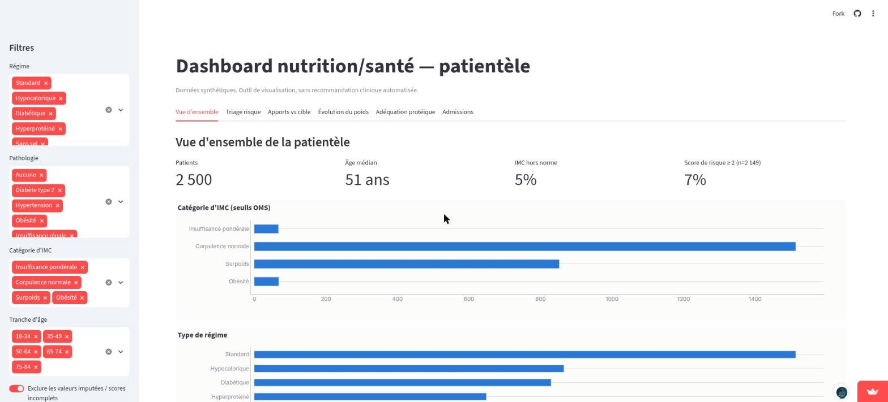
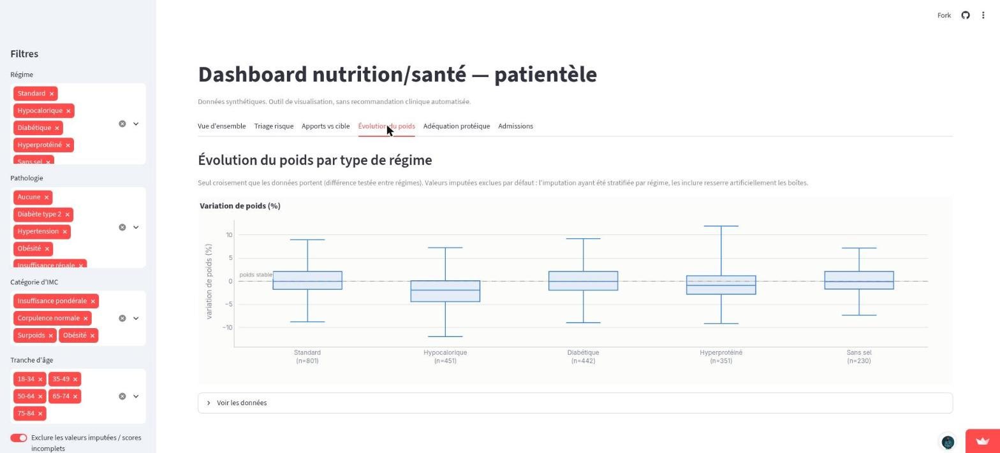
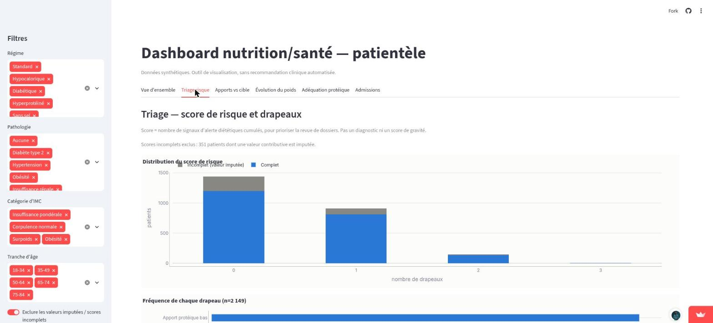
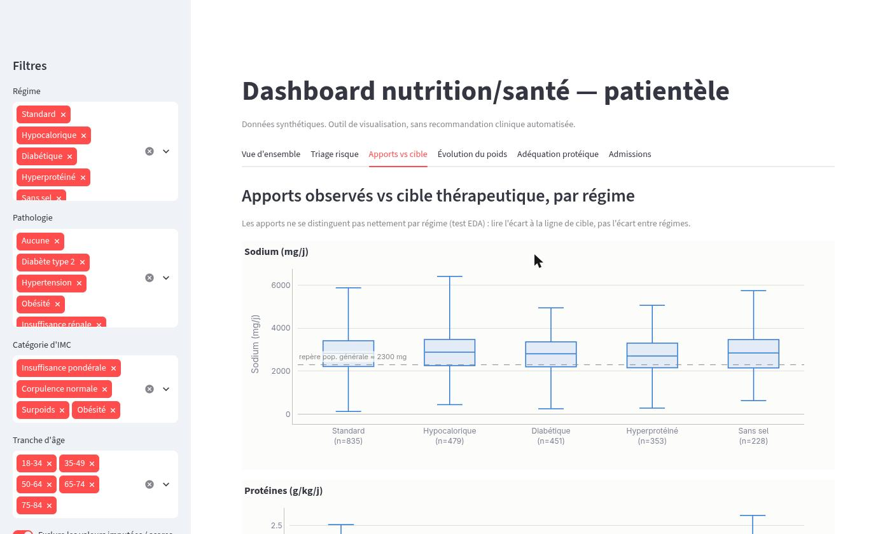

# Dashboard d'analyse nutrition/santé

**Dashboard déployé → https://nutrition-dashboard-louison.streamlit.app/**

Analyse d'un jeu de données synthétique de suivi nutritionnel (2500 patients) et
dashboard de visualisation pour un service de diététique.

## Aperçu

Vue d'ensemble de la patientèle (VIZ 1) :



Évolution du poids par type de régime (VIZ 4) — seul croisement que les données
portent :



Triage — score de risque et drapeaux (VIZ 2) :



Apports observés vs repère de population générale (VIZ 3) — la ligne de référence
est annotée « repère pop. générale », pas « cible », pour ne pas suggérer un
objectif clinique individuel :



## 1. Contexte métier

Projet mené pendant un stage sur **DietSnack**, plateforme de restauration diététique
adossée à une clinique proposant un suivi nutritionnel personnalisé (Maevatanana). Le
besoin : donner à un·e diététicien·ne ou à un·e responsable de service une lecture
rapide des tendances d'une file active — composition des profils, régimes prescrits,
adéquation des apports, évolution du poids, dossiers à revoir en priorité. Le jeu de
données est synthétique et reproduit la structure d'un export de suivi réel sans
contenir aucune donnée de patient.

## 2. Aperçu des 6 vues

Chaque onglet répond à une question que se pose le service sur sa patientèle :

| Vue | Question métier |
|---|---|
| Vue d'ensemble | Comment se compose ma file active (statut pondéral, régimes, pathologies) et combien de dossiers sont prioritaires ? |
| Triage risque | Quels dossiers revoir en priorité, et quel signal les fait remonter ? |
| Apports vs cible | Les apports observés (sodium, protéines) collent-ils à l'objectif du régime, ou les libellés de régime ne se traduisent-ils pas dans les apports ? |
| Évolution du poids | Les patients sous régime hypocalorique perdent-ils effectivement du poids, et comment se comparent les régimes entre eux ? |
| Adéquation protéique | Quelle part de la file est sous l'apport protéique de référence, et est-ce concentré sur certains âges ou pathologies ? |
| Admissions | Comment évolue le volume d'entrées au service sur la période couverte ? |

## 3. Démarche

Résumé par étape. Le détail (décision, alternatives écartées, pièges) est dans
[`DECISIONS.md`](DECISIONS.md) — un bloc par étape, non repris ici.

| Étape | Ce qui a été fait | Sortie |
|---|---|---|
| 1 — EDA | Structure, distributions, taux de valeurs manquantes par colonne, contrôle `bmi` fourni vs IMC recalculé, corrélations paire-à-paire (toutes \|r\| ≤ 0,03) | `notebooks/01_eda.ipynb` |
| 2 — Nettoyage | Traitement des manquants justifié colonne par colonne (imputation médiane, granularité décidée par test) ; 8 erreurs de saisie requalifiées en `NaN`, 20 valeurs sodium hautes mais plausibles conservées ; aucune ligne supprimée | `data/patients_nutrition_clean.csv` (15 + 3 colonnes `*_imputed`) |
| 3 — Feature engineering | `bmi_category` (seuils OMS), `protein_per_kg`, `risk_screen_score` (composite 0–4 orienté triage, conscient de l'imputation) | `data/patients_nutrition_features.csv` (27 colonnes) |
| 4 — Conception | 6 vues spécifiées avant tout code : question métier, type de graphique, gestion des imputés, parade au faux lien. Règle transverse : aucun croisement numérique × numérique | `DECISIONS.md` § Étape 4 |
| 5 — Dashboard | Streamlit + Plotly, 6 onglets, filtres transverses, palette fixe validée pour le daltonisme, tableau agrégé sous chaque graphique | `app.py` |
| 6 — Déploiement | Streamlit Community Cloud, thème clair épinglé (`.streamlit/config.toml`), aucun secret (données statiques et publiques) | lien en tête de ce fichier |

## 4. Limites explicites

- **Dataset synthétique** — 2500 lignes générées ; aucune donnée réelle de patient de
  la clinique.
- **Visualisation uniquement** — le dashboard agrège et affiche. Il ne produit aucune
  recommandation clinique automatisée, aucun score individuel prescriptif, aucune
  alerte patient.
- **Pas de suivi longitudinal réel** — l'évolution de poids et la durée de suivi sont
  des champs simulés, pas des séries mesurées dans le temps ; aucune vue n'affiche de
  trajectoire patient.
- **Seuils de référence = repères population générale** — 2300 mg/j (sodium) et
  0,8 g/kg/j (protéines) sont des repères OMS/EFSA à l'échelle d'une file active, pas
  des cibles individualisées par pathologie. Le rappel complet est dans le dashboard
  lui-même (onglets « Apports vs cible » et « Triage risque »).
- **Thème clair forcé** — l'application ne suit pas le mode sombre du navigateur : la
  palette des graphiques a été validée une seule fois pour un fond clair.

## 5. Lancer en local

```
pip install -r requirements.txt
streamlit run app.py
```

L'application lit `data/patients_nutrition_features.csv`. Barre latérale : filtres
régime, pathologie, catégorie d'IMC, tranche d'âge, et un interrupteur « exclure les
valeurs imputées / scores incomplets » (activé par défaut).

Régénérer les notebooks (artefacts, pas des sources) — chaque `_build_0X_*.py`
contient la liste ordonnée des cellules, l'exécute de bout en bout et écrit le
`.ipynb` :

```
python _build_01_eda.py       # -> notebooks/01_eda.ipynb
python _build_02_cleaning.py   # -> notebooks/02_cleaning.ipynb + data/patients_nutrition_clean.csv
python _build_03_features.py   # -> notebooks/03_features.ipynb + data/patients_nutrition_features.csv
```

Dépendances : dashboard → `streamlit`, `plotly`, `pandas` (`requirements.txt`) ;
notebooks → `pandas`, `numpy`, `scipy`, `matplotlib`, `seaborn`, `nbformat`,
`nbclient`, `ipykernel`.

## 6. Structure du dépôt

```
app.py                                  Dashboard Streamlit (point d'entrée)
requirements.txt                        Dépendances d'exécution du dashboard
.streamlit/config.toml                  Thème clair épinglé pour toute l'application
DECISIONS.md                            Journal méthodologique détaillé (un bloc par étape)

data/patients_nutrition.csv             Jeu source (2500 lignes, 15 colonnes)
data/patients_nutrition_clean.csv       Sortie de l'étape 2 (18 colonnes)
data/patients_nutrition_features.csv    Sortie de l'étape 3 (27 colonnes) — lu par app.py

notebooks/01_eda.ipynb                  EDA (exécuté)
notebooks/02_cleaning.ipynb             Nettoyage (exécuté)
notebooks/03_features.ipynb             Feature engineering (exécuté)
_build_01_eda.py                        Générateur du notebook d'EDA
_build_02_cleaning.py                   Générateur du notebook de nettoyage
_build_03_features.py                   Générateur du notebook de feature engineering
```

## Avancement

- [x] Étape 1 — EDA
- [x] Étape 2 — Nettoyage
- [x] Étape 3 — Feature engineering
- [x] Étape 4 — Conception du dashboard
- [x] Étape 5 — Construction Streamlit
- [x] Étape 6 — Déploiement
- [x] Étape 7 — Documentation finale
